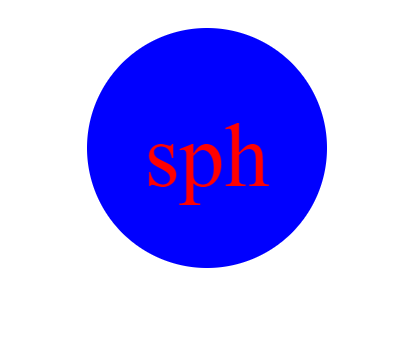

# svg-logo-generator

## Descripion

This project can be used to create a SVG logo

## technologys

The project uses Node and JavaScript

## learned

I learned how to use classes in JS

## Task

GIVEN a command-line application that accepts user input
WHEN I am prompted for text
THEN I can enter up to three characters
WHEN I am prompted for the text color
THEN I can enter a color keyword (OR a hexadecimal number)
WHEN I am prompted for a shape
THEN I am presented with a list of shapes to choose from: circle, triangle, and square
WHEN I am prompted for the shape's color
THEN I can enter a color keyword (OR a hexadecimal number)
WHEN I have entered input for all the prompts
THEN an SVG file is created named `logo.svg`
AND the output text "Generated logo.svg" is printed in the command line
WHEN I open the `logo.svg` file in a browser
THEN I am shown a 300x200 pixel image that matches the criteria I entered

## Usage

If the user opens the terminal for the folder of the project and types “node index.js” the terminal will start going through a list of prompts. Once all the prompts are completed the terminal will say “generated logo.svg” and a new file “logo.svg” will be created.

## Repo
https://github.com/hayessea000/svg-logo-generator

## Video of use
https://drive.google.com/file/d/118G7vBJy4iwfw0CTPNVRwK8sKqzLrEBk/view

